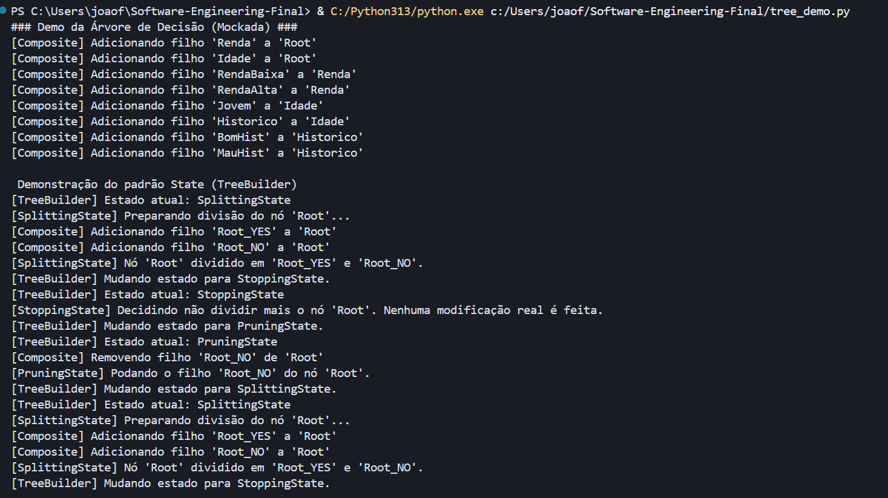
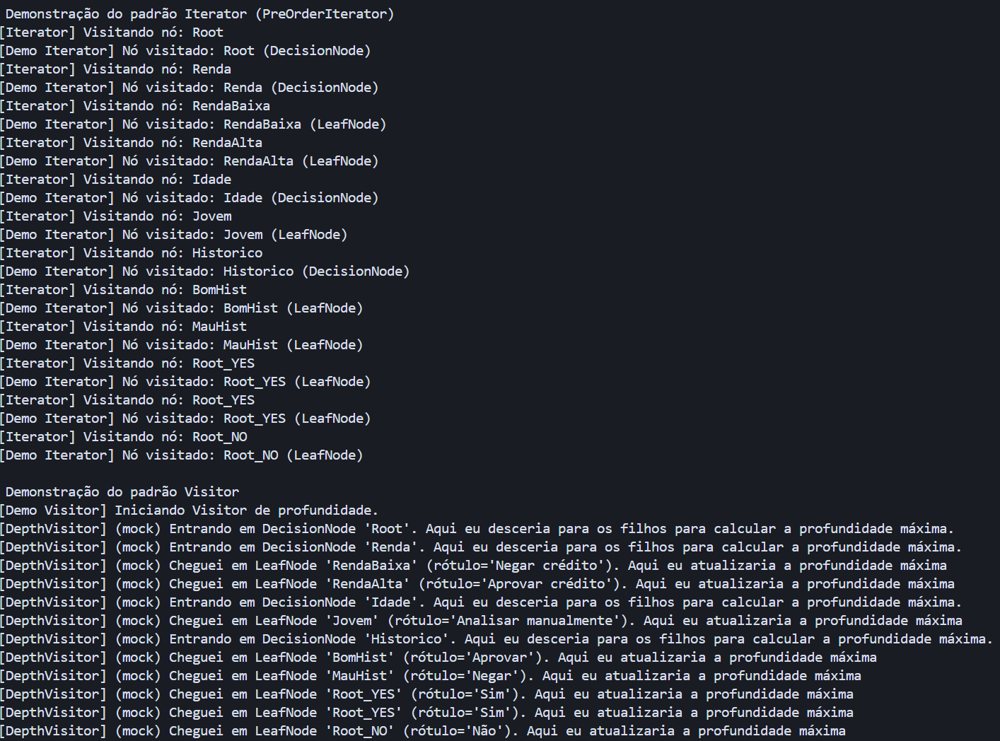

# Projeto Individual de Modelagem: Árvore de Decisão (Mock) - Engenharia de Software

Este projeto consiste na modelagem e implementação de uma estrutura de Árvore de Decisão Simplificada em Python. O foco principal aqui é a aplicação rigorosa de quatro padrões de projeto: Composite, Iterator, Visitor e State.

Simulamos aqui o comportamento de construção, navegação e análise de uma árvore, utilizando "mocks" (simulações via prints) para demonstrar as interações entre os objetos.

O objetivo foi modelar uma solução desacoplada e extensível que atendesse aos seguintes requisitos:
1.  Estrutura Hierárquica: Modelada com o padrão Composite.
2.  Navegação: Implementada via padrão Iterator (Pre-Order).
3.  Operações Independentes: Cálculos (profundidade, contagem) via padrão Visitor.
4.  Comportamento de Construção: Controle de fluxo (divisão, parada, poda) via padrão State.
5.  Restrições: Sem bibliotecas externas e sem cálculos reais.


## Arquitetura e Padrões de Projeto

A solução foi dividida em dois arquivos principais: `tree_design.py` (definições) e `tree_demo.py` (execução). Abaixo, o detalhamento de como cada padrão foi aplicado:

### 1. Composite
Responsável por tratar nós individuais e composições de nós de maneira uniforme.
 Componente: `Node` (Classe Abstrata).
 Composite: `DecisionNode` (Nós internos que possuem filhos e definem regras).
 Leaf: `LeafNode` (Nós finais que representam decisões/rótulos).
 Segurança: A classe `LeafNode` bloqueia a adição de filhos para garantir a integridade semântica da árvore.

### 2. Iterator
Responsável por permitir o acesso sequencial aos elementos da árvore sem expor sua representação subjacente.
 Implementação: `PreOrderIterator`.
 Funcionamento: Utiliza uma pilha (stack) para realizar uma travessia em profundidade (DFS).
 Integração: A classe `Node` implementa `__iter__`, permitindo o uso nativo do laço `for` do Python (`for node in tree:`).

### 3. Visitor
Responsável por definir novas operações sobre a estrutura de objetos sem alterar as classes dos elementos.
 Interface: `Visitor` (Abstrata).
 Implementações Concretas:
     `DepthVisitor`: Simula o cálculo da profundidade da árvore.
     `CountLeavesVisitor`: Simula a contagem de nós folha.
 Mecanismo: Utiliza Double Dispatch. O nó chama `visitor.visit_...(self)`, garantindo que o método correto do visitante seja executado.

### 4. State
Responsável por alterar o comportamento do objeto construtor da árvore quando seu estado interno muda.
 Contexto: `TreeBuilder`.
 Estados:
     `SplittingState`: Simula a divisão de um nó em novos filhos.
     `StoppingState`: Decide parar o crescimento daquele ramo.
     `PruningState`: Simula a poda (remoção) de nós desnecessários.
 Fluxo: O `TreeBuilder` delega a execução para o estado atual, que pode, por sua vez, transicionar o construtor para um novo estado.


##  Estrutura de Arquivos

 `tree_design.py`: Contém todas as classes, interfaces abstratas e lógica dos padrões de projeto.
 `tree_demo.py`: Arquivo cliente. Constrói uma árvore manualmente, instancia o `TreeBuilder` e os `Visitors`, e executa a demonstração com prints no console.


## Como Executar

1.  Execute o comando:

```bash
python tree_demo.py
```

## Resultados




